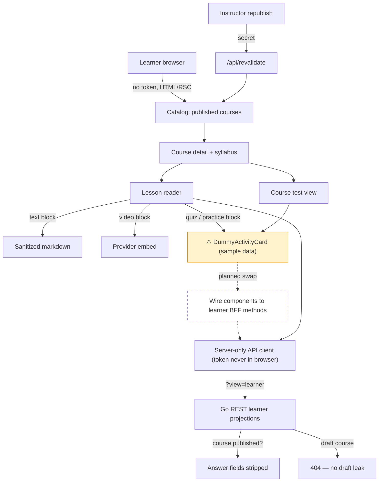

# Debrief: Learner reader app + answer-safe backend reads

**Date:** 2026-06-05 · **Commits:** 5e35c55..26e81eb (16 commits, CRS-66–CRS-81) · **Branch:** main (18 commits unpushed)

## TL;DR

A learner can now open a browser and read a published course end-to-end — catalog → syllabus → lesson with markdown and video — served by a new Next.js app that keeps the API token server-side. The backend also gained `?view=learner` projections that provably strip every answer field. The single most important next step: **the two halves aren't connected yet** — the reader still shows dummy quiz/practice/test data even though the safe real data is ready to serve.

## Why this was built

This is the new arc from `docs/roadmap-learner-app-and-content.md`: after the backend arc (Phases A–F) finished the course domain, CLI, import pipeline, and REST API, there was no way for a *student* to consume a course. The arc decided on a Bun + Next.js reader (superseding the old "Go-served htmx console" decision), with two guardrails: the API token never reaches the browser, and the learner path must never receive correct answers, reference solutions, or hidden test cases.

## What actually shipped

Two phases landed back-to-back:

**Phase L1 — the reader (CRS-66–75).** A `web/` workspace with App Router pages: a catalog showing only published courses, a course detail page with ordered syllabus, and a lesson reader that renders text blocks as sanitized markdown and video blocks as provider embeds. Quiz/practice blocks and the course test view render from **clearly-labeled dummy data** ("Sample data" badge), per the plan — so L1 didn't block on backend work. All REST calls go through a typed server-only client (`web/src/lib/course-api/`); the token lives in `COURSE_CLI_API_TOKEN`, server-side only. Caching is on-demand: a `/api/revalidate` route (guarded by `COURSE_REVALIDATION_SECRET`) invalidates published content when an instructor republishes. Loading/empty/not-found/error states exist on every route.

**Phase L2 — learner-safe projections, backend half (CRS-76–81).** The Go REST adapter now accepts `?view=learner` on quiz, practice, and test detail reads. Learner responses omit `CorrectIndices`, pre-submit `Explanation`, practice `Solution`/`TestCases`/`ExpectedStdout`, `TestSolution`, and all choice/coding answer fields (full contract in `docs/learner-safe-read-projections.md`). Learner reads of unpublished courses return 404, so drafts don't even leak their existence. The BFF gained matching `getLearnerQuiz/Practice/Test` methods.

**Planned but not shipped:** the final handoff — swapping the reader's dummy activity cards for the real learner projections. The BFF methods exist but no component calls them; `lesson-reader.tsx` still renders `DummyActivityCard`.

### The feature at a glance

## How to see it working

1. Start the Go API: `go run . rest` (binds the REST adapter; needs Postgres migrated and a published course — use the CLI/import pipeline).
2. In `web/`: set `COURSE_API_BASE_URL=http://127.0.0.1:8788`, `COURSE_CLI_API_TOKEN`, `COURSE_REVALIDATION_SECRET`, then `bun install && bun run dev`.
3. Open `http://localhost:3000` — you should see only published courses; click into a course, then a lesson; text and video render for real, quiz/practice show the "Sample data" badge.
4. Prove answer safety directly: `curl -H "Authorization: Bearer $TOKEN" ".../v1/quizzes/{id}?view=learner"` — no `CorrectIndices` in the response; the same URL without `?view=learner` returns full fidelity.
5. Republish a course, hit `/api/revalidate` with the secret, reload the catalog — content updates without a timer.

**What the tests prove:** Go-side regression tests serialize learner responses and fail if any answer-bearing field name reappears (CRS-81); web-side transport tests fail if a learner BFF method ever calls an instructor URL; a Phase L1 acceptance suite covers catalog → lesson rendering and route states. **Untested:** the dummy→real swap path (it doesn't exist yet), and end-to-end behavior against a live backend (all web tests run against fakes).

## Loose ends

- `docs/roadmap-learner-app-and-content.md` and `docs/walkthrough.html` are **untracked** — commit or discard before they get lost.
- 18 commits are unpushed on `main`.
- Practice test cases are entirely hidden on the learner path — the backend has no "learner-visible test case" marker yet, so learners see zero examples. Deliberate, but a content-quality gap.
- The reader treats post-submit explanations/grading as unavailable; that's the deferred attempt/grading phase, not a bug.

## What's next

1. **Wire the reader to the learner projections** — replace `buildDummyActivity` in `lesson-reader.tsx` and the test view with `getLearnerQuiz/Practice/Test` from `web/src/lib/course-api/server`. Everything is staged for this (contract, BFF methods, regression tests); it's the only thing between "demo" and "real product," and `docs/learner-safe-read-projections.md` §Web BFF Handoff is the exact spec.
2. **Load real course material (Phase C1)** — run the import pipeline to publish an actual course. Until real content exists, the reader can't be honestly evaluated, and it unblocks visual polish against `design/course.html`.
3. **Commit the stray docs and push main** — cheap, and removes the risk of losing the roadmap that defines this whole arc.

**Not yet worth worrying about:** learner attempts/grading/progress (explicitly deferred to a later phase), per-learner auth (token is the sole gate by decision #3), and a web authoring console (instructor authoring stays on the CLI this arc).
