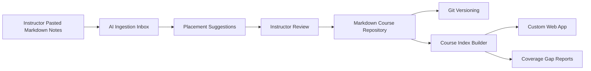
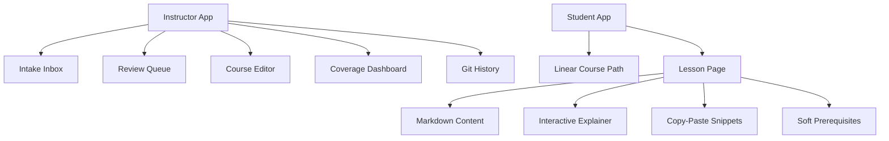
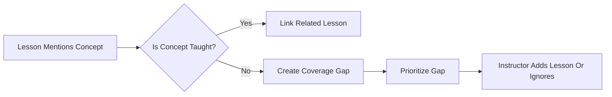

# Entropy Course System Design

## Product Shape

Entropy Course is a markdown-first instructor workbench for building a living developer encyclopedia. The system helps an instructor quickly capture rough course material, asks AI to suggest where that material belongs, and then turns approved material into structured lessons, interactive explainers, and a custom web app experience.

The first course focuses on JavaScript and TypeScript, but the system should support multiple future courses such as Go and Rust.

## Core Principles

- Markdown files are the canonical source of truth.
- Git provides versioning, history, review, and rollback.
- AI suggests placement and metadata; the instructor approves changes.
- The first student experience is a linear learning path.
- Prerequisites are soft recommendations, not hard gates.
- Interactive explainers are code-based components.
- Snippets are copy-paste blocks until a later practice/sandbox phase.
- Localization is deferred; English is the first language.
- The system tracks coverage gaps and weak spots in the curriculum.

## System Overview



## Main Workflows

### 1. Capture Rough Material

The instructor pastes markdown notes into an inbox. Notes may be complete lessons, quick thoughts, code snippets, outlines, TODOs, or fragments.

The system stores each note as an intake item before any course file is changed.

### 2. Suggest Placement

AI analyzes the intake item and proposes:

- course
- chapter
- concept
- target markdown file path
- prerequisite concepts
- related concepts
- difficulty level
- summary
- extracted snippets
- coverage gaps introduced or resolved

The AI should not commit changes directly to the course. It prepares a proposal for review.

### 3. Instructor Review

The instructor compares the original note with the suggested placement.

Review actions:

- approve as new lesson
- append to existing lesson
- split into multiple concepts
- merge with existing concept
- edit metadata
- reject
- park for later

### 4. Commit To Markdown

Approved changes are written to the markdown course repository and committed through Git.

Each change should produce a clear commit message, for example:

```text
Add Redis TTL notes to backend infrastructure
```

### 5. Build Course Index

A course index builder reads markdown frontmatter and file structure to produce derived indexes for the web app:

- courses
- chapters
- lessons
- concepts
- prerequisites
- snippets
- interactive component references
- coverage gaps

### 6. Publish To Custom Web App

The custom web app renders the course as a linear path first, with concept metadata and soft prerequisite hints available when useful.

## Suggested Repository Structure

```text
courses/
  js-ts/
    course.yml
    00-workspace-setup/
      ide-setup.md
      terminal-basics.md
      node-and-package-managers.md
    01-programming-foundations/
      variables.md
      functions.md
      async-programming.md
    02-web-development/
      http-basics.md
      api-design.md
    03-backend-infrastructure/
      redis.md
      opentelemetry.md

  golang/
    course.yml

  rust/
    course.yml

components/
  explainers/
    js-ts/
      redis-ttl.tsx
      event-loop.tsx

intake/
  inbox/
  reviewed/

generated/
  indexes/
    courses.json
    concepts.json
    coverage-gaps.json
```

## Markdown Lesson Format

Each lesson should use frontmatter so the web app can index it reliably.

```markdown
---
title: Redis TTL
course: js-ts
chapter: backend-infrastructure
order: 30
difficulty: beginner
status: draft
prerequisites:
  - http-basics
  - api-design
related:
  - redis-cache-invalidation
  - backend-performance
explainer:
  component: redis-ttl
snippets:
  - redis-cli-set-ttl
coverage:
  teaches:
    - ttl
    - cache-expiration
  mentions:
    - cache-invalidation
---

# Redis TTL

...
```

## Course Configuration

Each course should have a `course.yml` file.

```yaml
id: js-ts
title: JavaScript and TypeScript Developer Path
language: en
status: active
defaultPath: linear
audience:
  - absolute-beginner
  - stack-switching-engineer
chapters:
  - id: workspace-setup
    title: Workspace Setup
    order: 0
  - id: programming-foundations
    title: Programming Foundations
    order: 1
  - id: web-development
    title: Web Development
    order: 2
  - id: backend-infrastructure
    title: Backend Infrastructure
    order: 3
```

## Web App Information Architecture



## Instructor Screens

### Intake Inbox

Purpose: fast capture.

Primary actions:

- paste markdown
- assign optional course
- submit for AI suggestion
- view status

### Review Queue

Purpose: keep the instructor in control.

Panels:

- original input
- AI proposal
- target file preview
- extracted metadata
- coverage impact
- approve/edit/reject actions

### Course Editor

Purpose: inspect and edit markdown-backed course material.

Features:

- course tree
- chapter ordering
- lesson metadata
- markdown preview
- explainer component binding
- snippet list

### Coverage Dashboard

Purpose: reveal weak areas in the living encyclopedia.

Reports:

- mentioned but not taught
- lessons with no prerequisites
- lessons with unresolved prerequisites
- beginner path gaps
- missing snippets
- missing interactive explainers
- overgrown lessons that should be split

### Git History

Purpose: make curriculum evolution visible.

Features:

- recent commits
- changed lessons
- diff viewer
- rollback guidance
- release notes for course updates

## Student Lesson Layout

The student view starts with a linear path.

```text
+-----------------------------------------------------------------+
| JavaScript and TypeScript Developer Path                         |
+---------------+-------------------------------------------------+
| Course Path   | Lesson: Redis TTL                               |
|               |                                                 |
| 00 Setup      | Soft prerequisites: HTTP Basics, API Design      |
| 01 Basics     |                                                 |
| 02 Web        | +---------------------+-----------------------+ |
| 03 Backend    | | Interactive          | Copy-Paste Snippets   | |
|               | | Explainer            |                       | |
|               | |                     | redis-cli SET ...     | |
|               | |                     | redis-cli TTL ...     | |
|               | +---------------------+-----------------------+ |
|               |                                                 |
|               | Markdown lesson content continues below.         |
+---------------+-------------------------------------------------+
```

## AI Suggestion Contract

The AI should produce structured suggestions that can be validated before any file write.

```json
{
  "course": "js-ts",
  "action": "append_to_existing_lesson",
  "targetPath": "courses/js-ts/03-backend-infrastructure/redis.md",
  "confidence": 0.82,
  "title": "Redis TTL",
  "summary": "Explains how Redis keys expire and how TTL supports cache freshness.",
  "prerequisites": ["http-basics", "api-design"],
  "related": ["cache-invalidation", "backend-performance"],
  "snippets": [
    {
      "id": "redis-cli-set-ttl",
      "language": "bash",
      "code": "redis-cli SET user:1 '{\"name\":\"Ada\"}' EX 60"
    }
  ],
  "coverageImpact": {
    "teaches": ["ttl", "cache-expiration"],
    "mentions": ["cache-invalidation"],
    "newGaps": ["cache-invalidation"]
  },
  "reviewNotes": ["This note appears to belong after basic API caching is introduced."]
}
```

## Coverage Gap Model

Coverage gaps are generated from the difference between what the course mentions and what it teaches.



Gap fields:

```yaml
id: cache-invalidation
title: Cache Invalidation
mentionedIn:
  - courses/js-ts/03-backend-infrastructure/redis.md
severity: medium
suggestedChapter: backend-infrastructure
reason: Mentioned while teaching Redis TTL, but no dedicated explanation exists.
status: open
```

## MVP Scope

The first useful version should include:

- one course: JavaScript and TypeScript
- markdown intake inbox
- AI placement suggestion
- instructor review queue
- markdown file write after approval
- Git commit per approved change
- course index builder
- student linear path
- lesson page with markdown, snippets, and optional explainer component slot
- basic coverage gap dashboard

## Later Phases

### Phase 2

- on-demand rewrite and lesson expansion
- richer interactive component authoring
- lesson split and merge assistance
- release notes generation from Git history

### Phase 3

- executable practice sandbox
- quizzes and exercises
- student progress
- topic browsing beyond the linear path

### Phase 4

- localization
- multi-language course families
- cross-course concept linking
- public/private publishing modes

## Open Product Questions

1. Should intake notes live as markdown files in Git, or can they live in an app database until approved?
2. Should AI suggestions be stored permanently for auditability?
3. Should the instructor approve one Git commit per note, or batch multiple approved notes into one commit?
4. Should course ordering be controlled by folder prefixes, `course.yml`, or both?
5. Should interactive explainer components be manually linked by ID, or can the system suggest likely components?
6. How should the system mark a lesson as beginner-friendly versus advanced reference material inside the same living encyclopedia?
7. Should coverage gaps have severity manually set by the instructor, AI-estimated, or both?
